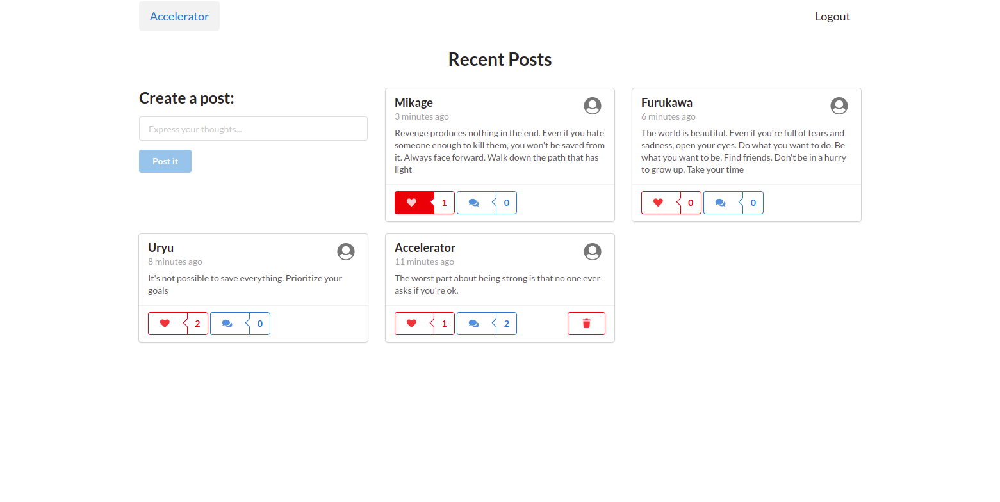
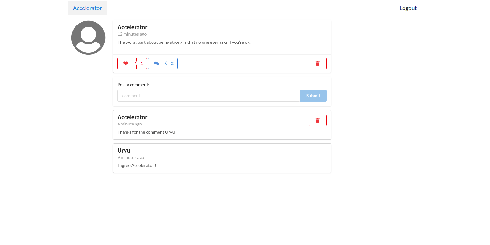

# Chirrup Project

## Description

Social media application that allows users to publish posts, react to each others posts by liking or commenting.

## Frameworks and Libraries

This app was created with React, Smantic UI React and GraphQL.

### React

React (also known as React.js or ReactJS) is a free and open-source front-end JavaScript library for building user interfaces or UI components. It is maintained by Facebook and a community of individual developers and companies.

### Semantic UI

Semantic UI is a front-end development framework designed for theming. It contains pre-built semantic components that helps create beautiful and responsive layouts using human-friendly HTML

### GraphQL

GraphQL is an open-source data query and manipulation language for APIs, and a runtime for fulfilling queries with existing data. GraphQL was developed internally by Facebook in 2012 before being publicly released in 2015.

## Technical description and Configuration

### Front End

The React app is nested inside the client folder of this project.
You can specify the URI of the GraphQL in the client/utils/config.js file

```json
{
  "apolloServerUri": "http://localhost:5000"
}
```

You can change the colors of the application by changing the values in client/utils/colors.js

```json
{
  "primary": "blue",
  "likeButton": "red",
  "deleteButton": "red",
  "commentButton": "blue"
}
```

To run the application, change directory to client then run the following commands:

```bash
$ npm install
$ npm start
```

To build the application, change directory to client then run the following commands:

```bash
$ npm install
$ npm build
```

### Back End

To run the application, you must set the following environment variables:

```
CU_SECRET_KEY
CU_DB_URI
CU_PORT
```

Then run the application using the following commands:

```bash
$ npm install
$ npm start
```

## Preview

### Home Page



### Post Page


